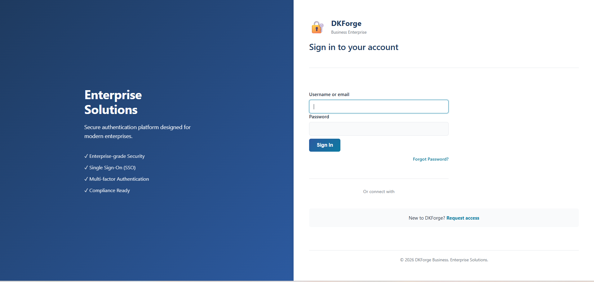
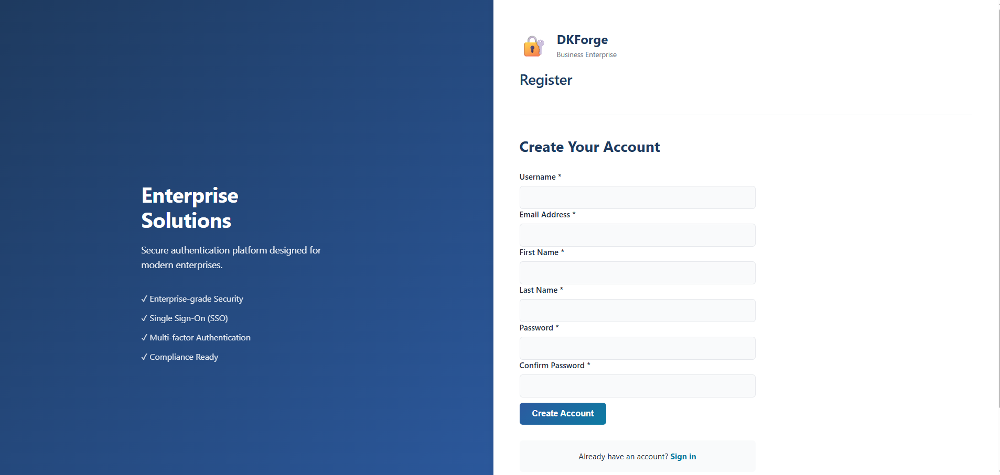
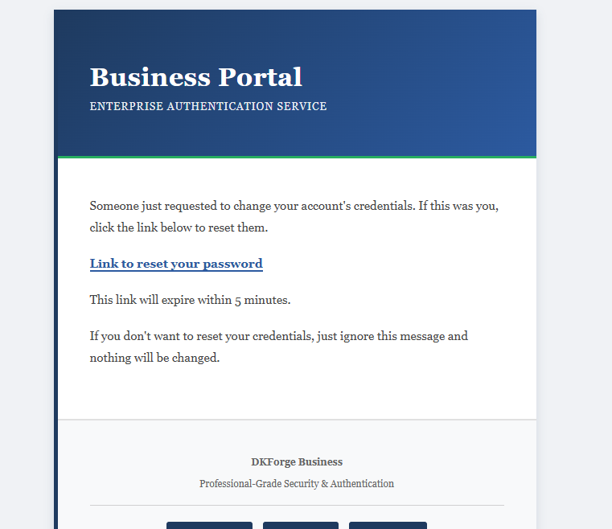

# DKForge-Business-Free

**DKForge-Business-Free** is a professional **Keycloak theme** designed for enterprise-grade authentication systems.  
It provides a clean, modern UI with responsive layout and customizable branding, suitable for production environments.

This repository contains a **fully functional free theme**, not a demo.

---


## ✨ Features

- Enterprise-style design
- Responsive layout (desktop & mobile)
- Customizable colors, fonts, and branding
- Custom login, register,otp pages
- Email template styling included
- Optimized for production use
- Compatible with modern Keycloak versions

---


## 🖼 Preview





---

## 🚀 Installation (Basic)

1. Copy the `DKForge-Business` folder into:

```bash
keycloak/themes/
```

2. Restart Keycloak
3. Select **DKForge-Business** from the Keycloak Admin Console:
- Realm Settings → Themes

---

## 🎨 Customization

You may customize:
- Colors & fonts
- Logos & branding
- CSS styles
- Email templates

Advanced customization and documentation are available in the **commercial versions**.

---

## 📦 Commercial Versions

More DKForge themes, theme bundles, advanced customization guides, and commercial licensing are available on Gumroad:

👉 **[Get the full DKForge themes & bundles](https://gumroad.com/)**  
*(link will be updated)*

---

## 📄 License

This project is licensed under the **MIT License**.  
You are free to use, modify, and integrate this theme in personal or commercial projects.

---

## ⚠️ Disclaimer

This theme is provided **as-is**, without warranties.  
Compatibility with future Keycloak versions is not guaranteed.

---

## 👤 Author

**DKForge**  
